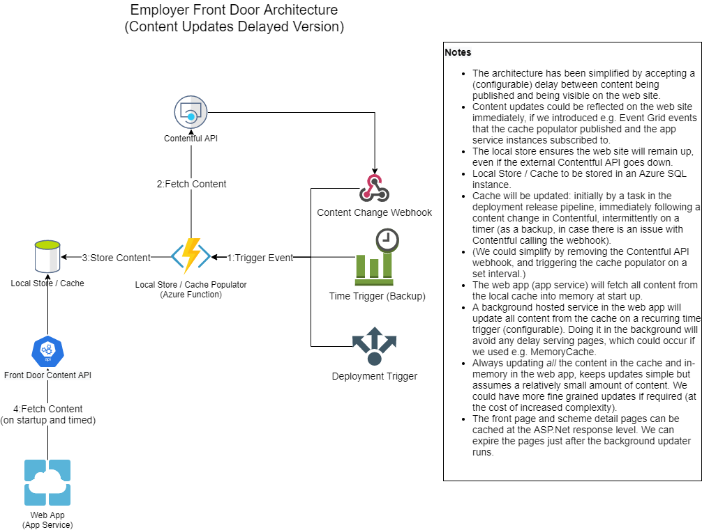

# _Employers Front Door_


[](https://sfa-gov-uk.visualstudio.com/Digital%20Apprenticeship%20Service/_build/latest?definitionId=2686&repoName=SkillsFundingAgency%2Fdas-find-employment-schemes&branchName=refs%2Fpull%2F75%2Fmerge)
[](https://trello.com/b/7rko6qQ2/cx-employers-beta)
[](https://skillsfundingagency.atlassian.net/wiki/spaces/_pageurl_) (TODO: Update)
[](https://en.wikipedia.org/wiki/MIT_License)

_Add a description of the project and the high-level features that it provides. This should give new developers an understanding of the background of the project and the reason for its existence._

_For Example_

```
The ServiceBus Support Utility is an Azure ServiceBus Queue management tool that allows you to manage messages that have moved to error queues without having to resort to managing each message individually.

1. Utilises Azure Active Directory for Authentication
2. Automatically enumerates error queues within the Azure Service Bus namespace
3. Messages can be retrieved per queue
4. Retrieved messages can be:
    - Aborted - all retrieved messages will be placed back on the queue they were received from
    - Replayed - messages will be moved back onto the original processing queue so that they can be processed again
    - Deleted - messages will be removed and will be no longer available for processing
```

## How It Works



[Local Store Strategy](docs/Local Store Strategy.md)

_Add a description of how the project works technically, this should give new developers an insight into the how the project hangs together, the core concepts in-use and the high-level features that it provides_

_For Example_
```
The ServiceBus Utility is a combination of website and background processor that enumerates Azure Service Bus queues within a namespace using the error queue naming convention and presents them to the user as a selectable list, allowing messages on a queue to be retrieved for investigation. Once a queue has been selected the website will retrieve the messages from the error queue and place them into a CosmosDB under the exclusive possession of the logged in user. Once the messages have been moved into the CosmosDB the background processor will ensure that those messages are held for a maximum sliding time period of 24 hours. If messages are still present after this period expires the background processer will move them back to the error queue automatically so that they aren't held indefinitely.

Depending on the action performed by the user the messages will follow one of three paths. In the event that the user Aborts the process, the messages are moved back to the error queue they came from, if the user replays the messages they will be placed back onto the "processing queue" they were on prior to ending up in the error queue and will be removed from the CosmosDB. If the user deletes the messages then they will be removed from the CosmosDB and will be gone forever.
```

## 🚀 Installation

### Pre-Requisites

_Add the pre-requisites needed to successfully run the project so that new developers know how they are to setup their development environment_

_For Example_
```
* A clone of this repository
* A code editor that supports Azure functions and .NetCore 3.1
* A CosmosDB instance or emulator
* An Azure Service Bus instance
* An Azure Active Directory account with the appropriate roles as per the [config](https://github.com/SkillsFundingAgency/das-employer-config/blob/master/das-tools-servicebus-support/SFA.DAS.Tools.Servicebus.Support.json)
* The [das-audit](https://github.com/SkillsFundingAgency/das-audit) API available either running locally or accessible in an Azure tenancy    
```
### Config

This utility uses the standard Apprenticeship Service configuration. All configuration can be found in the [das-employer-config repository](https://github.com/SkillsFundingAgency/das-employer-config/blob/master/das-find-employment-schemes/SFA.DAS.FindEmploymentSchemes.Web.json).

```
AppSettings.Development.json file
```json
{
    "Logging": {
      "LogLevel": {
        "Default": "Information",
        "Microsoft": "Warning",
        "Microsoft.Hosting.Lifetime": "Information"
      }
    },
    "ConfigurationStorageConnectionString": "UseDevelopmentStorage=true;",
    "ConfigNames": "SFA.DAS.Tools.Servicebus.Support,SFA.DAS.AuditApiClient",
    "EnvironmentName": "LOCAL",
    "Version": "1.0",
    "APPINSIGHTS_INSTRUMENTATIONKEY": ""
  }  
```

Azure Table Storage config

Row Key: SFA.DAS.FindEmploymentSchemes.Web_1.0

Partition Key: LOCAL

Data:

```json
{
  "ConnectionStrings": {
      "Redis": "localhost:6379"
  },
  "NLog": {
      "LogLevel": "Info"
  },
  "Endpoints": {
    "BaseURL": "https://localhost:44318/"
  }
  "ContentUpdates": {
      "Enabled": true,
      "CronSchedule": "*/30 * * * *"
  },
  "ContentfulOptions": {
    "DeliveryApiKey": "<Ask for key>",
    "ManagementApiKey": "",
    "PreviewApiKey": "<Ask for key>",
    "SpaceId": "082i50qdtar9",
    "UsePreviewApi": false,
    "MaxNumberOfRateLimitRetries": 0
  }
}
```

## 🔗 External Dependencies

This project _can_ auto update content from a correctly configured Contentful space. An export of the required space is in the Contenful folder.

Alternatively, you can set ContentUpdates:Enabled to false, to run without requiring a Contentful space set up.

## Technologies

The key technologies used in the project are:

```
* .NetCore 3.1
* Contentful
* xUnit
* FakeItEasy
```

## 🐛 Known Issues

N/A
